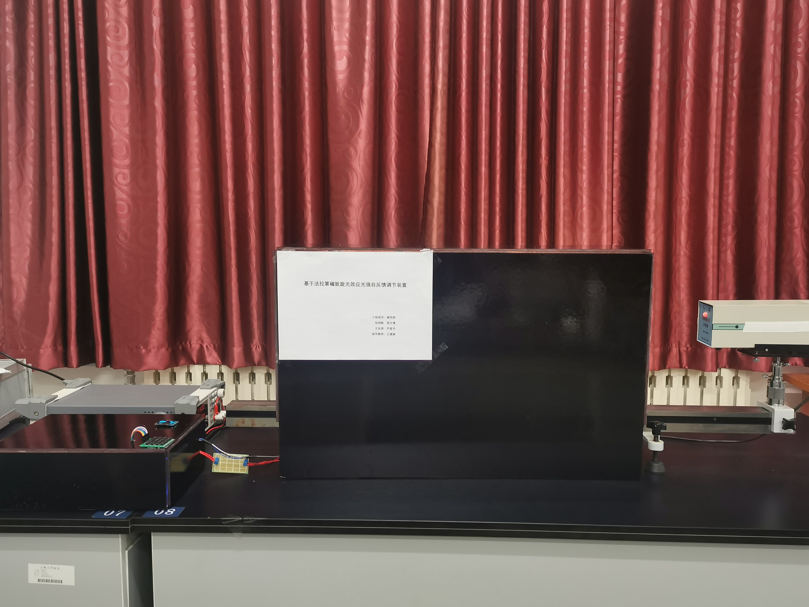
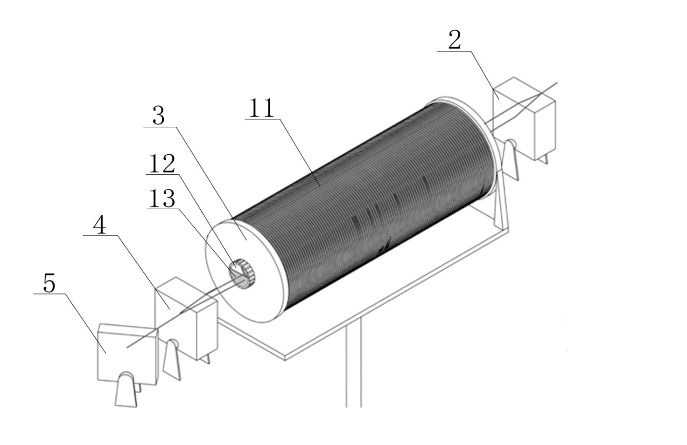
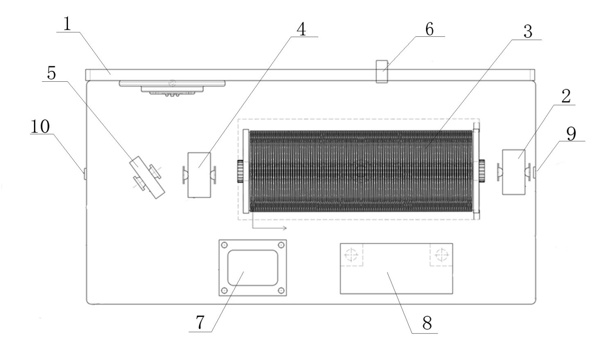
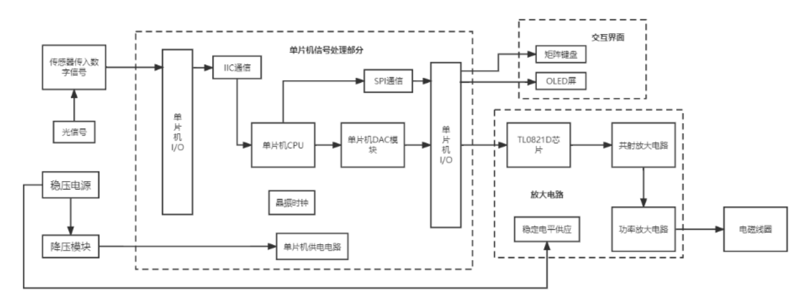
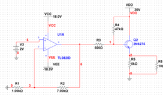
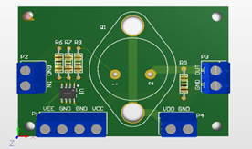

## 基于法拉第效应的光强自稳定实验装置设计与研究
> ➢ 发明专利：一种基于法拉第效应的光强自稳定系统（CN202210476717.8） 
> ➢ 实用新型：一种基于法拉第效应的光强稳定调节系统（CN202221034861.8） 
> 获得奖项：吉林大学物理学院大创年度优秀结题、大学生物理实验竞赛优秀奖
---------------------------
### 简介
基于法拉第效应的旋光特性设计搭建实验光路。其利用光强检测系统及控制电路调节磁场强度以实现接收端光强的实时动态调节，同时解决了光源和传播路径对激光光强的影响。通过研究，设计了对应的控制程序。此外，本装置在调节和稳定光强方面具有响应速度快、造价低、可小型化的优点，不仅可以应用于需要光强稳定的仪器设备，也可以应用于日常生活中的许多设备

-----------------------------

### 光学装置实物及模型

> 图像说明：1.壳体   2.第一方解石   3.磁致旋光器   4.第二方解石   5.分光镜   6.光电检测传感器   7.单片机   8.稳流电源   9.入射孔   10.出射孔   11.电磁线圈   12.通光孔   13.重火石晶体 

* 关于光学原理实现与实验验证：[原理说明文档](introduce/基于法拉第效应的光强自稳定实验装置设计与研究.pdf)

### 电控部分流程图

* **信号放大电路**
信号放大电路的作用是将单片机DAC模块输出的0-2V信号放大并提高带载能力，使其能够给线圈提供足够的电流以改变磁场。首先通过TI082芯片将0-2V信号线性放大为0-16V，再通过三极管组成的放大电路提高带载能力并进行输出

* **单片机主控系统**
基于STM32F1实现的主控系统，可以接受光强传感器的数据，根据设计的算法进行调节，输出对应的目标电流给信号放大电路。另外，设计了矩阵键盘用于调整目标光强和OLED屏进行状态监控

