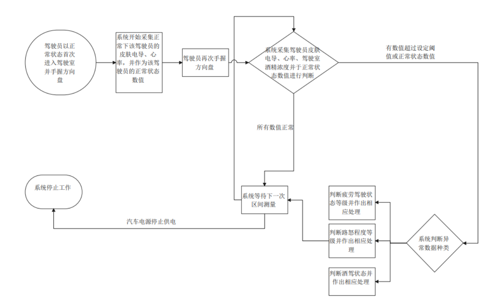

### 路易运安-智能驾驶检测系统
>➢ 发明专利：一种驾驶员驾驶情绪状态及驾驶姿势的监测系统（CN202210512266.9） 
> 获得奖项：吉林大学物理学院国家级大创项目，吉林大学互联网+校内赛银奖
---------------------------
### 简介

本项目是一个以皮肤电信号分析为核心的“驾驶员异常状态检测并处理装置”，以皮肤电传感器检测“疲劳驾驶”状态，并添加心率传感器作为开始使用皮肤电检测“路怒症”的开关；并使用酒精浓度传感器检测“酒驾”状态，在多个方面联合检测驾驶的异常状态以保证驾驶员的安全驾驶，同时设计了配套的演示版微信小程序，便于后续实现进一步的智能化。本项目能够及时地检测出驾驶员的危险驾驶情况，为后续的汽车主动安全技术提供支持，进一步促进了车辆的智能化，为今后的自动驾驶、车联网以及车路协同等新兴产品打下了基础

* 关于项目的细节及商业分析可见[说明文档1](doc/技术文档（含商业分析）.pdf)
--------------------------
### 系统整体架构

--------------------------
### 实物建模图

--------------------------
### 算法优势

本项目抛弃了传统的绝对数值比较选取基态,激发态两个状态的相对值比较，兼顾了人员之间的个体化差异,有创新的从生理信号出发尝试判断受测人员的状态，虽然距离真正的市场化运用还有很长的一段路程，但是其简单的判别模式，个性化的监测手段，对生理信号的直接运用分析，对比于现有的市场产品有独特优势

* 关于更多项目技术细节可见[说明文档2](doc/技术文档.pdf)
