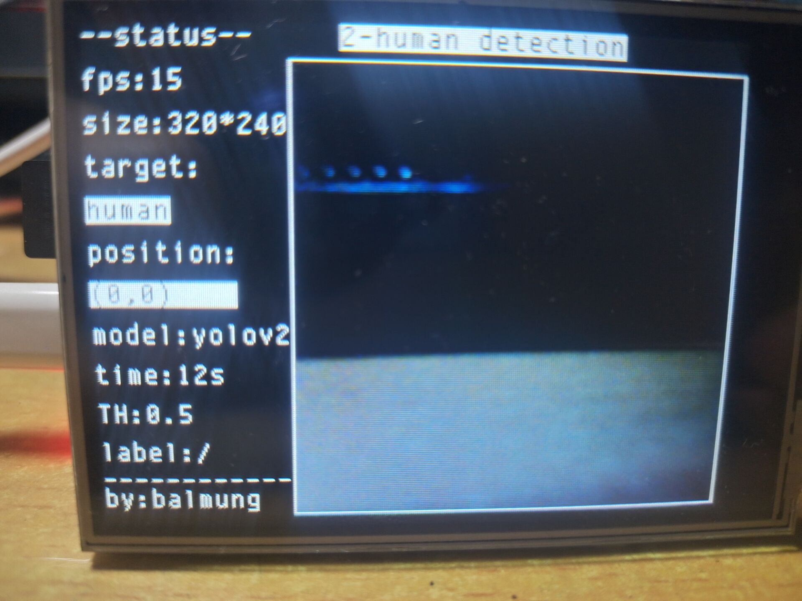
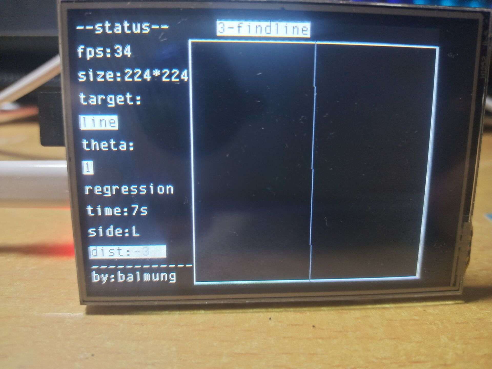
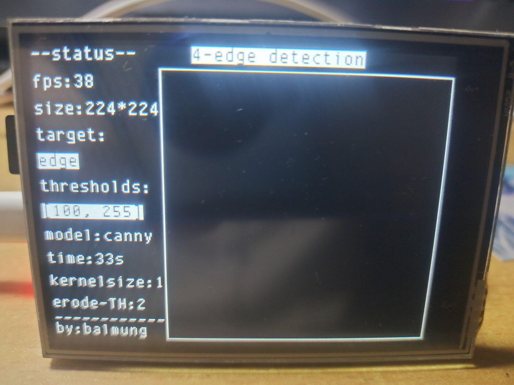
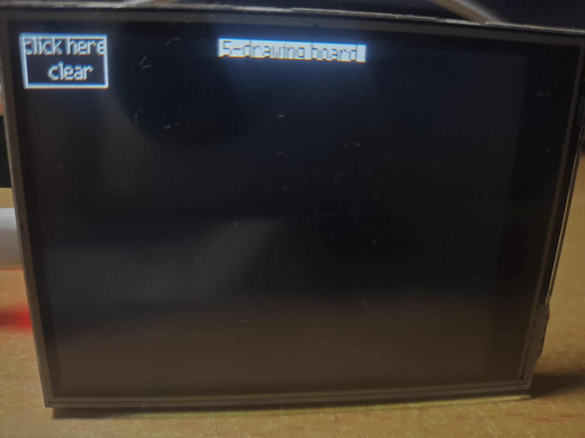
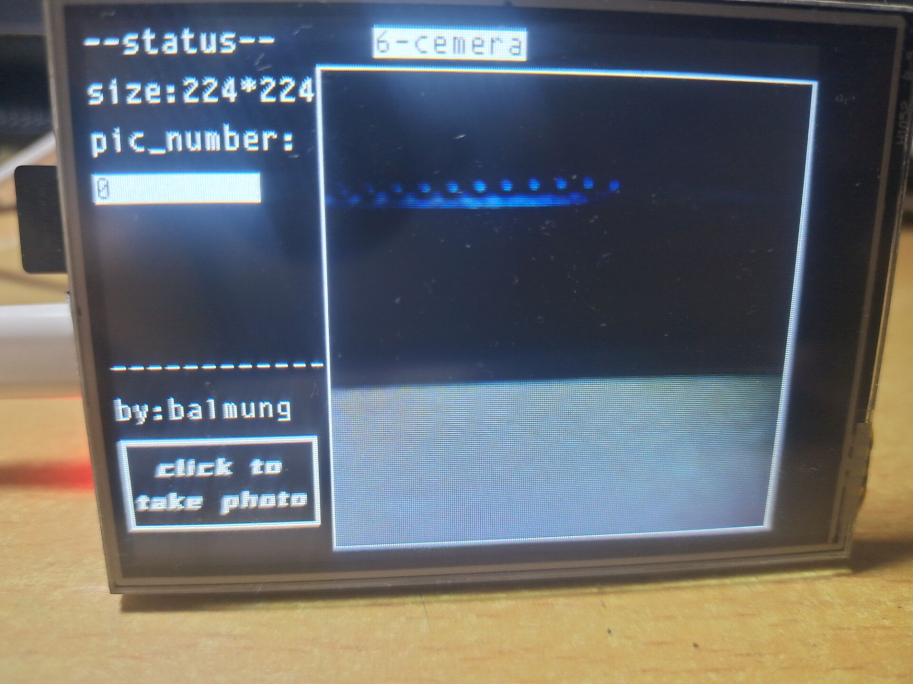
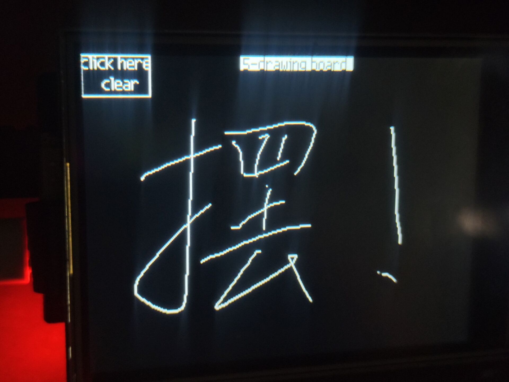

# 基于k210与micropython搭建的一个简单的摄像头操作程序
> 基于01studio出品的k210开发板与固件；将resource-sd文件夹的内容放进sd卡即可使用
1. 基于yolov2的各类识别(模型来自在线训练网站)

2. 回归巡线

3. 边缘提取

4. 画板

5. 224*224像素的简单相机

------------------------------

