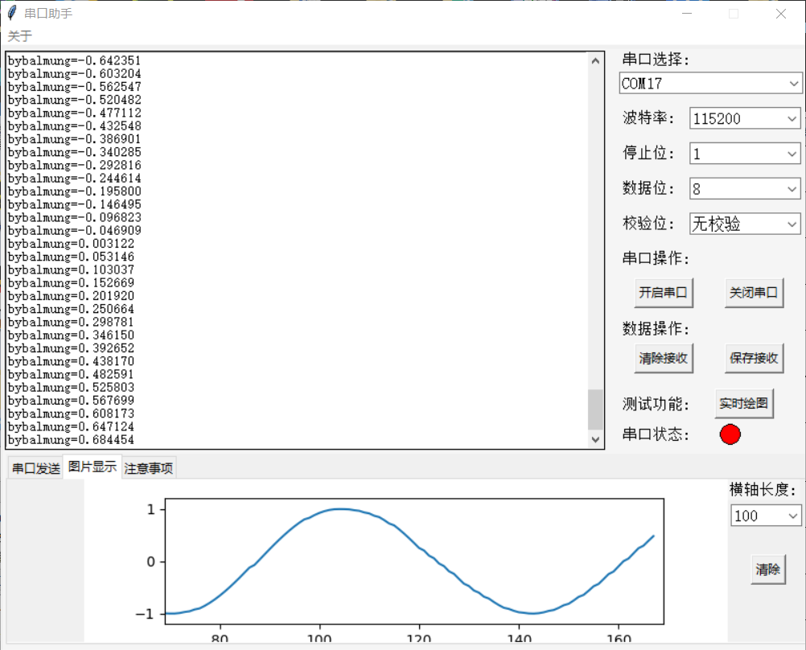

# 简易串口助手
### pyserial
* 实现串口通信的基本需求，控制比特率等通信指标
### tkinter
* python自带UI库，实现串口助手的数据展示、实时操控等交互功能
### matplotlib
* 实现数据绘图功能；由于设计时的疏忽，线程过多导致数据绘图仅在20次/秒内有较高准确度，有待优化
### 效果展示

-----------------------
> 本项目还涉及到串口通信的基本知识、多线程设计、matplotlib嵌入tk以及交互逻辑设计；此外，绘图需要在标准格式中提取需要的数据，还需要正则表达式（re）的相关知识
